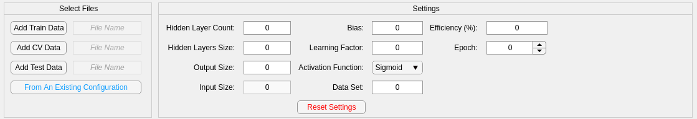
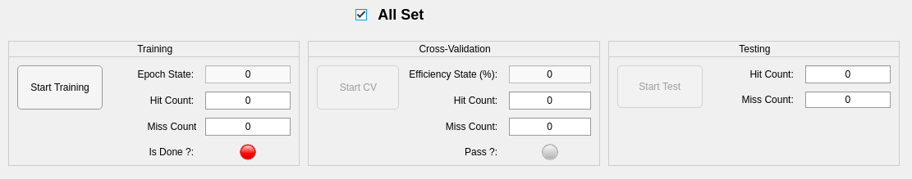
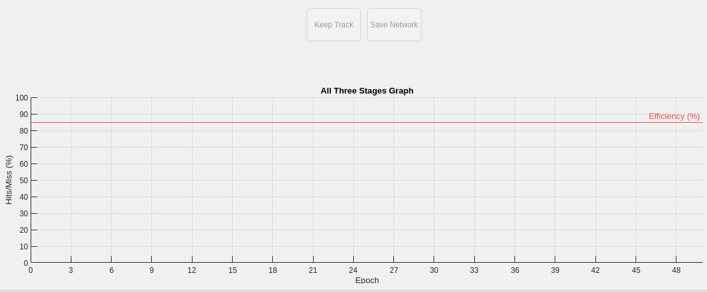

ÉTAPES:

	1- S'assurer que le dossier output et input soient ajouté au projet dans Matlab.
	2- Ouvrez mlp.mlapp qui est l'interface utilisateur.
	
	2.1- Entrer les données et règler les paramètres du réseau de neurones:
	

	
	2.2- Lorsque tout est prêt, cocher "All Set" qui permet d'activer le bouton pour l'entrainement.
	

	2.3- Lorsque l'entrainement est terminé, la lumière est mise à verte et le bouton de la vérification croisée est activée.
	2.4- Après la vérification croisée, si celle-ci ne passe pas le seuil de établi (Efficiency) le bouton de teste ne s'active pas.
	2.4.1- Alors, il est possible d'augmenter l'epoch et de reclicker "Start Training" pour continuer l'entrainement.
		 Si le seuil est satisfait, alors le bouton "Start Test" s'active.

	3- Si on est satisfait des résultats obtenu, on peut sauvegarder la configuration.

	
	4- Il est possible de partir d'une configuration existante avec "Frome an exsisting configuration"

